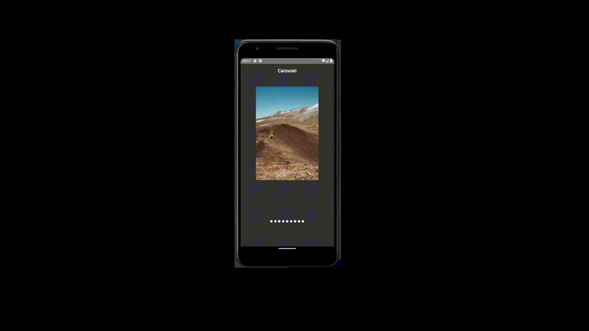

# React Native Carousel 📱 

É um carousel de images desenvolvidos com typescript, feito para aprender como faria algumas das features.

### Tecnologias usadas

- styled components
- typescript
- react navigation

### como utilizar:

observação: ambiente react-native configurado, yarn ou npm para baixar dependências do projeto.

```bash 
  git clone https://github.com/Carlos-Reiss/react-native-carousel.git

  cd react-native-carousel

  yarn android 

  yarn start
```

